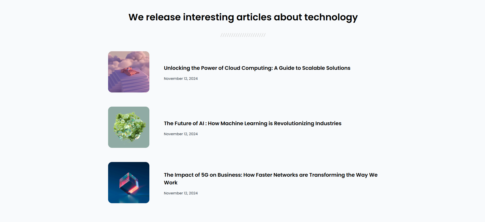

<!-- Please update value in the {}  -->

<h1 align="center">Simple Article Listing | devChallenges</h1>

   Solution for a challenge <a href="https://devchallenges.io/challenge/simple-article-listing" target="_blank">Simple Article Listing</a> from <a href="http://devchallenges.io" target="_blank">devChallenges.io</a>.

  <h3>
    <a href="https://codebyev.github.io/simple-article-listing/">
      Demo
    </a>
     | 
    <a href="https://devchallenges.io/challenge/simple-article-listing">
      Challenge
    </a>
  </h3>

## Overview

Challenge by devchallenges.io to create simple article listing using HTML and CSS.

